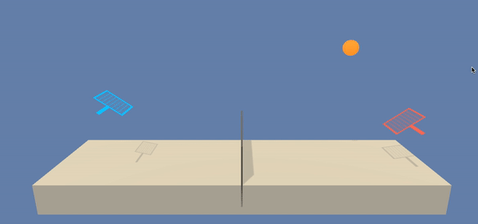
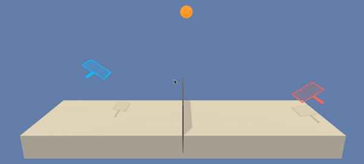

# Collaborate and Competition

| Untrained Agents Playing Tennis | 
| ------------------------------- | 
| | 

|   Trained Agents Playing Tennis | 
| ------------------------------- | 
|  |


In this environment, two agents control rackets to bounce a ball over a net. If an agent hits the ball over the net, it receives a reward of +0.1. If an agent lets a ball hit the ground or hits the ball out of bounds, it receives a reward of -0.01. Thus, the goal of each agent is to keep the ball in play.

The observation space consists of 8 variables corresponding to the position and velocity of the ball and racket. Each agent receives its own, local observation. Two continuous actions are available, corresponding to movement toward (or away from) the net, and jumping.

```
INFO:unityagents:
'Academy' started successfully!
Unity Academy name: Academy
        Number of Brains: 1
        Number of External Brains : 1
        Lesson number : 0
        Reset Parameters :
		
Unity brain name: TennisBrain
        Number of Visual Observations (per agent): 0
        Vector Observation space type: continuous
        Vector Observation space size (per agent): 8
        Number of stacked Vector Observation: 3
        Vector Action space type: continuous
        Vector Action space size (per agent): 2
        Vector Action descriptions: ,
```
```
The reshaped state vector for the first agent looks like:
racket x pos      0.0 0.0 -6.6527862548828125
racket y pos      0.0 0.0 -1.5
racket x velocity 0.0 0.0 -0.0
racket y velocity 0.0 0.0 0.0
ball   x pos      0.0 0.0 6.83172082901001
ball   y pos      0.0 0.0 6.0
ball   x velocity 0.0 0.0 -0.0
ball   y velocity 0.0 0.0 0.0
```
The task is episodic, and in order to solve the environment, your agents must get an average score of +0.5 (over 100 consecutive episodes, after taking the maximum over both agents). Specifically,

* After each episode, we add up the rewards that each agent received (without discounting), to get a score for each agent. This yields 2 (potentially different) scores. We then take the maximum of these 2 scores.
* This yields a single score for each episode.

The environment is considered solved, when the average (over 100 episodes) of those scores is at least +0.5.

## Getting started
### Configuration
PC configuration used for this project:

* OS: Mac OS 11.3 El Capitan
* Processor: 1.3 GHz Intel Core i5
* Memory: 4GB 1600MHz DDR3
* Graphics: Intel HD Graphics 5000 1536MB

### Environment setup
For detailed Python environment setup (PyTorch, Unity Environment, and a few more Python packages) please follow these [steps](https://github.com/udacity/deep-reinforcement-learning#dependencies): 

### Structure
All project files are structured as follows:

* maddpg_agent.py - It contains agent, noise and replay buffer class implementation. agent class interacts with and learns from the environment. replay buffer class has a fixed-size buffer to store experience tuples. noise class is used to explore the environment more.
* model.py - It contains the neural network architecture for the actor and critic networks.
* checkpoint_actor_0.pth- It contains the trained model weights of the actor network of the first agent.
* checkpoint_actor_1.pth- It contains the trained model weights of the second actor network of the second agent.
* checkpoint_critic_0.pth- It contains the trained model weights of the critic network of the first agent.
* checkpoint_critic_1.pth- It contains the trained model weights of the critic network  of the second agent.
* Report.md- Explains the algorithm used and ideas for future improvement.
* README.md- It describes the project environment details, installation instruction and running code.
* images- This folder contains diiferent images used in the project.
* Reacher20.app- It contains the built in unity environment used in the project.
* Tennis.ipynb- This notebook contains training code for the agent and our solution for this environment.
