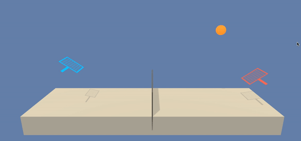

# Project report
### Learning algorithm

* There are many interesting papers out there on MARL. One particular paper is called [“Multi Agent Actor Critic for Mixed Cooperative Competitive environments“](https://papers.nips.cc/paper/7217-multi-agent-actor-critic-for-mixed-cooperative-competitive-environments.pdf) by OpenAI. This paper used a multi-agent decentralized actor, centralized crtic appraoch as shown below:


* We can also apply single agent techniques to multi-agent case in two approaches:
	* Non-stationarity approach: In this approach, all the agents are trained independently without considering the existence of other agents. In this approach, any agent considers all the other agents as part of the environment and learn its own policy. Since all agents are learning simultaneously, the environment as seen seen from the perspective of a single agent changes dynamically. Hence this non-stationarity condition does not guarante convergence.

	* Meta Agent approach: This approach takes into account the existence of multiple agents. Here a single policy is learned learned for all the agents. It takes as input the present state of the environment and returns the action of each agent in the form of a single joint action vector. The joint action vector increases exponentially with the number of agents. This approach works well when each agent knows everything about the environment.

	* In this project, we have applied this second approach with an adapted [DDPG algorithm](https://arxiv.org/abs/1509.02971):

		* In DDPG, we use two deep neural networks for each agent: actor and critic. The actor is used to approximate optimal policy deterministically. The critic learns to evaluate the optimal action value function by using the actor's best believed action. 

		* We use a regular (or local) and target networks for both the actor and ctitic networks. The regular networks are the most up to date networks that we are training. While target networks are used for prediction to stabilize training.

		* We also use replay buffer to save the state, action, reward, next state, done tuples and soft update to mix a small percentage of the regular or local networks parameters with the target networks parameters. Also a random noise is added with action value of the actor networks for facilitating the exploration.


### Parameters used in DDPG algorithm:

* BUFFER_SIZE = int(1e6)  # replay buffer size
* BATCH_SIZE = 128        # minibatch size
* LR_ACTOR = 1e-3         # learning rate of the actor
* LR_CRITIC = 1e-3        # learning rate of the critic
* WEIGHT_DECAY = 0        # L2 weight decay
* LEARN_EVERY = 1         # learning timestep interval
* LEARN_NUM = 1           # number of learning passes
* GAMMA = 0.99            # discount factor
* TAU = 7e-2              # for soft update of target parameters
* OU_SIGMA = 0.2          # Ornstein-Uhlenbeck noise parameter, volatility
* OU_THETA = 0.12         # Ornstein-Uhlenbeck noise parameter, speed of mean reversion
* EPS_START = 5.5         # initial value for epsilon in noise decay process in Agent.act()
* EPS_EP_END = 250        # episode to end the noise decay process
* EPS_FINAL = 0           # final value for epsilon after decay      
              
      

### Network Architecture

The actor networks used in our implementation have the following architecture:

Layer        | (in, out) | Batchnorm | Activation      
-------------|-----------|-----------|-----------
Layer 1 | (State_size*2,256)|no|ReLU
Layer 2 | (256,128)|no|ReLU
Layer 3 | (128,action_size)|no|tanh

The critic networks used in our implementation have the following architecture:

Layer        | (in, out) | Batchnorm | Activation      
-------------|-----------|-----------|-----------
Layer 1 | (State_size*2,256)|no|ReLU
Layer 2 | (256+action_size*2,128)|no|ReLU
Layer 3 | (128,1)|no|-


### Results


```
Episodes 	Max Reward	Min Reward	Avg Reward	Moving Average in last 100 episodes
0001-0010	0.000		0.000		0.000		0.000
0011-0020	0.100		0.000		0.020		0.000
0021-0030	0.100		0.000		0.010		0.000
0031-0040	0.000		0.000		0.000		0.000
0041-0050	0.000		0.000		0.000		0.000
0051-0060	0.000		0.000		0.000		0.000
0061-0070	0.000		0.000		0.000		0.000
0071-0080	0.000		0.000		0.000		0.000
0081-0090	0.000		0.000		0.000		0.000
0091-0100	0.000		0.000		0.000		0.003
0101-0110	0.000		0.000		0.000		0.003
0111-0120	0.000		0.000		0.000		0.001
0121-0130	0.000		0.000		0.000		0.000
0131-0140	0.000		0.000		0.000		0.000
0141-0150	0.100		0.000		0.030		0.003
0151-0160	0.100		0.000		0.040		0.007
0161-0170	0.100		0.000		0.010		0.008
0171-0180	0.000		0.000		0.000		0.008
0181-0190	0.100		0.000		0.010		0.009
0191-0200	0.100		0.000		0.020		0.011
0201-0210	0.100		0.000		0.010		0.012
0211-0220	0.100		0.000		0.010		0.013
0221-0230	0.100		0.000		0.010		0.014
0231-0240	0.100		0.000		0.010		0.015
0241-0250	0.100		0.000		0.010		0.013
0251-0260	0.100		0.000		0.020		0.011
0261-0270	0.100		0.000		0.010		0.011
0271-0280	0.100		0.000		0.030		0.014
0281-0290	0.100		0.000		0.030		0.016
0291-0300	0.100		0.000		0.020		0.016
0301-0310	0.200		0.000		0.030		0.018
0311-0320	0.100		0.000		0.030		0.020
0321-0330	0.100		0.000		0.030		0.022
0331-0340	0.200		0.000		0.050		0.026
0341-0350	0.100		0.000		0.030		0.028
0351-0360	0.100		0.000		0.030		0.029
0361-0370	0.100		0.000		0.030		0.031
0371-0380	0.100		0.000		0.030		0.031
0381-0390	0.100		0.000		0.020		0.030
0391-0400	0.200		0.000		0.070		0.035
0401-0410	0.100		0.000		0.060		0.038
0411-0420	0.100		0.000		0.070		0.042
0421-0430	0.200		0.000		0.080		0.047
0431-0440	0.100		0.000		0.040		0.046
0441-0450	0.500		0.000		0.120		0.055
0451-0460	0.100		0.000		0.070		0.059
0461-0470	0.400		0.000		0.080		0.064
0471-0480	0.200		0.000		0.070		0.068
0481-0490	0.300		0.000		0.110		0.077
0491-0500	0.300		0.000		0.140		0.084
0501-0510	0.200		0.000		0.100		0.088
0511-0520	0.300		0.000		0.070		0.088
0521-0530	0.100		0.000		0.030		0.083
0531-0540	0.300		0.000		0.050		0.084
0541-0550	0.300		0.000		0.090		0.081
0551-0560	0.100		0.000		0.020		0.076
0561-0570	0.200		0.000		0.030		0.071
0571-0580	0.500		0.000		0.150		0.079
0581-0590	0.300		0.000		0.160		0.084
0591-0600	0.300		0.000		0.140		0.084
0601-0610	0.300		0.100		0.160		0.090
0611-0620	0.400		0.000		0.150		0.098
0621-0630	0.200		0.000		0.070		0.102
0631-0640	0.300		0.000		0.140		0.111
0641-0650	0.300		0.000		0.120		0.114
0651-0660	0.300		0.100		0.160		0.128
0661-0670	0.200		0.000		0.070		0.132
0671-0680	0.300		0.000		0.110		0.128
0681-0690	0.300		0.000		0.120		0.124
0691-0700	0.300		0.000		0.120		0.122
0701-0710	0.300		0.000		0.110		0.117
0711-0720	0.200		0.100		0.140		0.116
0721-0730	0.200		0.000		0.100		0.119
0731-0740	0.400		0.000		0.140		0.119
0741-0750	0.200		0.000		0.070		0.114
0751-0760	0.400		0.000		0.190		0.117
0761-0770	0.300		0.100		0.150		0.125
0771-0780	0.300		0.100		0.140		0.128
0781-0790	0.300		0.000		0.080		0.124
0791-0800	0.200		0.000		0.110		0.123
0801-0810	0.200		0.100		0.120		0.124
0811-0820	0.300		0.100		0.120		0.122
0821-0830	0.300		0.100		0.130		0.125
0831-0840	0.400		0.100		0.150		0.126
0841-0850	0.300		0.000		0.130		0.132
0851-0860	0.600		0.000		0.180		0.131
0861-0870	0.300		0.100		0.130		0.129
0871-0880	0.300		0.000		0.140		0.129
0881-0890	0.300		0.000		0.160		0.137
0891-0900	0.600		0.000		0.140		0.140
0901-0910	0.100		0.100		0.100		0.138
0911-0920	0.300		0.100		0.120		0.138
0921-0930	0.100		0.100		0.100		0.135
0931-0940	0.500		0.100		0.210		0.141
0941-0950	0.200		0.100		0.110		0.139
0951-0960	0.400		0.000		0.140		0.135
0961-0970	0.500		0.000		0.159		0.138
0971-0980	0.200		0.100		0.110		0.135
0981-0990	0.500		0.000		0.170		0.136
0991-1000	0.300		0.100		0.120		0.134
1001-1010	0.100		0.000		0.090		0.133
1011-1020	0.100		0.100		0.100		0.131
1021-1030	0.200		0.100		0.110		0.132
1031-1040	0.400		0.100		0.140		0.125
1041-1050	0.200		0.100		0.140		0.128
1051-1060	0.100		0.100		0.100		0.124
1061-1070	0.200		0.100		0.130		0.121
1071-1080	0.400		0.100		0.150		0.125
1081-1090	0.200		0.100		0.120		0.120
1091-1100	0.300		0.100		0.130		0.121
1101-1110	0.300		0.100		0.150		0.127
1111-1120	0.200		0.100		0.120		0.129
1121-1130	0.300		0.100		0.120		0.130
1131-1140	0.900		0.100		0.260		0.142
1141-1150	0.500		0.100		0.180		0.146
1151-1160	0.400		0.100		0.190		0.155
1161-1170	0.400		0.100		0.200		0.162
1171-1180	0.200		0.000		0.110		0.158
1181-1190	0.500		0.100		0.220		0.168
1191-1200	0.600		0.100		0.210		0.176
1201-1210	0.400		0.100		0.210		0.182
1211-1220	1.100		0.100		0.320		0.202
1221-1230	1.000		0.100		0.370		0.227
1231-1240	1.000		0.200		0.330		0.234
1241-1250	1.000		0.100		0.450		0.261
1251-1260	1.400		0.100		0.480		0.290
1261-1270	0.500		0.000		0.220		0.292
1271-1280	1.200		0.100		0.410		0.322
1281-1290	0.600		0.100		0.240		0.324
1291-1300	1.500		0.100		0.440		0.347
1301-1310	1.200		0.100		0.400		0.366
1311-1320	0.700		0.000		0.250		0.359
1321-1330	0.500		0.100		0.270		0.349
1331-1340	1.800		0.100		0.590		0.375
1341-1350	1.500		0.100		0.440		0.374
1351-1360	0.500		0.000		0.230		0.349
1361-1370	0.800		0.100		0.290		0.356
1371-1380	0.700		0.100		0.260		0.341
1381-1390	0.700		0.100		0.350		0.352
1391-1400	1.400		0.100		0.590		0.367
1401-1410	1.200		0.000		0.490		0.376
1411-1420	1.300		0.200		0.700		0.421
1421-1430	3.000		0.000		0.800		0.474
1431-1440	1.600		0.000		0.450		0.460
1441-1450	1.500		0.200		0.610		0.477
<-- Environment solved in 1356 episodes!                 
<-- Moving Average: 0.500 over past 100 episodes
1451-1460	2.600		0.000		0.830		0.537
1461-1470	1.500		0.000		0.610		0.569
1471-1480	1.900		0.000		0.390		0.582
1481-1490	1.100		0.200		0.510		0.598
1491-1500	0.500		0.000		0.210		0.560
1501-1510	1.300		0.000		0.400		0.551
<-- Best episode so far!                
Episode 1514	Max Reward: 3.800	Moving Average: 0.563
1511-1520	3.800		0.000		0.910		0.572
1521-1530	3.100		0.100		1.050		0.597
1531-1540	3.300		0.000		0.700		0.622
1541-1550	2.700		0.100		0.800		0.641
<-- Best episode so far!                
Episode 1552	Max Reward: 5.200	Moving Average: 0.706
1551-1560	5.200		0.000		1.220		0.680
1561-1570	1.300		0.100		0.350		0.654
<-- Best episode so far!                
Episode 1576	Max Reward: 5.200	Moving Average: 0.716
<-- Best episode so far!                
Episode 1577	Max Reward: 5.200	Moving Average: 0.768
1571-1580	5.200		0.100		1.770		0.792
<-- Best episode so far!                
Episode 1588	Max Reward: 5.200	Moving Average: 0.852
1581-1590	5.200		0.000		1.220		0.863
1591-1600	1.400		0.100		0.600		0.902
1601-1610	2.700		0.100		0.970		0.959
1611-1620	1.900		0.100		0.550		0.923
1621-1630	4.400		0.000		0.860		0.904
1631-1640	5.200		0.000		1.440		0.978
<-- Best episode so far!                
Episode 1640	Max Reward: 5.200	Moving Average: 0.978
<-- Best episode so far!                
Episode 1643	Max Reward: 5.200	Moving Average: 1.020
<-- Best episode so far!                
Episode 1644	Max Reward: 5.200	Moving Average: 1.069
<-- Best episode so far!                
Episode 1647	Max Reward: 5.200	Moving Average: 1.084
1641-1650	5.200		0.100		2.490		1.147
<-- Best episode so far!                
Episode 1657	Max Reward: 5.200	Moving Average: 1.148
1651-1660	5.200		0.100		1.230		1.148
<-- Best episode so far!                
Episode 1662	Max Reward: 5.200	Moving Average: 1.199
<-- Best episode so far!                
Episode 1663	Max Reward: 5.200	Moving Average: 1.238
<-- Best episode so far!                
Episode 1664	Max Reward: 5.300	Moving Average: 1.288
1661-1670	5.300		0.100		2.260		1.339
1671-1680	5.200		0.000		0.800		1.242
<-- Best episode so far!                
Episode 1683	Max Reward: 5.300	Moving Average: 1.372
1681-1690	5.300		0.000		2.120		1.332
1691-1700	0.600		0.000		0.160		1.288
1701-1710	5.200		0.000		1.560		1.347
1711-1720	5.200		0.000		1.810		1.473
1721-1730	5.200		0.100		2.220		1.609
1731-1740	5.200		0.100		2.180		1.683
1741-1750	5.200		0.100		1.660		1.600
1751-1760	4.200		0.000		0.780		1.555
1761-1770	1.500		0.000		0.350		1.364
1771-1780	5.100		0.100		1.100		1.394
1781-1790	4.000		0.100		1.210		1.303
1791-1800	1.300		0.100		0.280		1.315
1801-1810	4.300		0.000		1.480		1.307
1811-1820	3.300		0.000		0.850		1.211
1821-1830	2.700		0.000		0.480		1.037
1831-1840	0.500		0.000		0.120		0.831
1841-1850	3.700		0.100		1.410		0.806
1851-1860	1.500		0.100		0.360		0.764
<-- Training stopped. Best score not matched or exceeded for 200 episodes

```


| Untrained Agents Playing Tennis | 
| ------------------------------- | 
| | 

|   Trained Agents Playing Tennis | 
| ------------------------------- | 
|  |


### Ideas for future work
1. Solve a more difficult environment, where the goal is to train a small team of agents to play soccer.[envirorment](https://s3-us-west-1.amazonaws.com/udacity-drlnd/P3/Soccer/Soccer.app.zip)
1. Apply other algorithms to solve the multi-agent environment 
	1. Proximal Policy Optimization Algorithms ([PPO](https://arxiv.org/pdf/1707.06347.pdf))
	1. Asynchronous Methods for Deep Reinforcement Learning ([A3C](https://arxiv.org/pdf/1602.01783.pdf))
	1. Distributed Distributional Deterministic Policy Gradients ([D4PG](https://openreview.net/pdf?id=SyZipzbCb))
